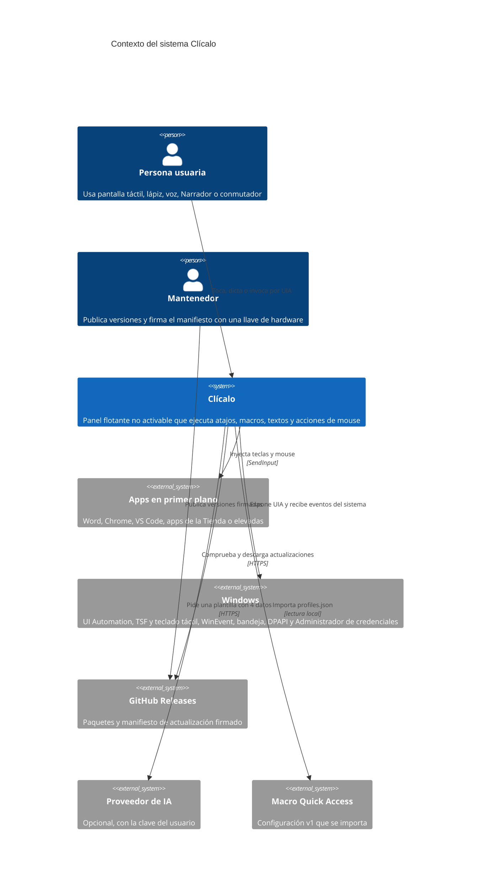
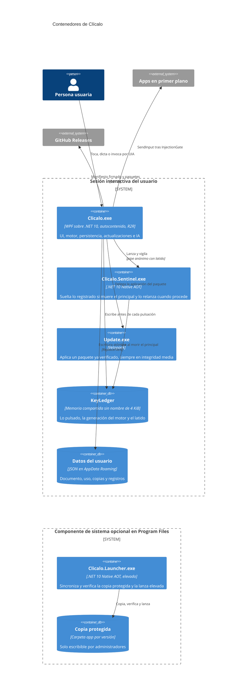
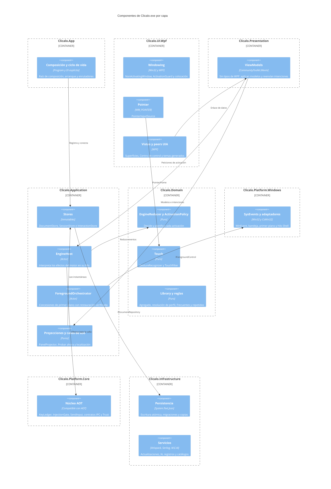
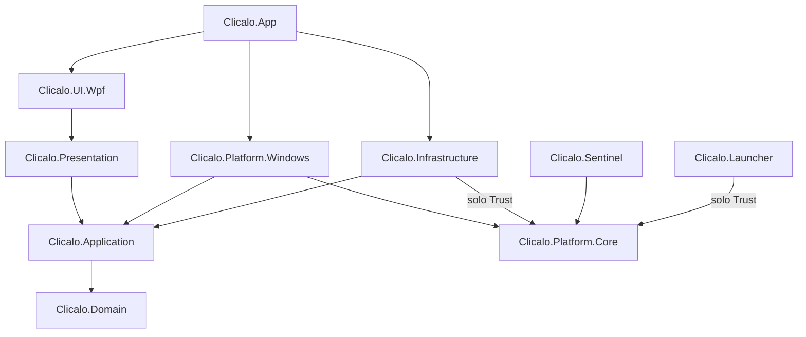
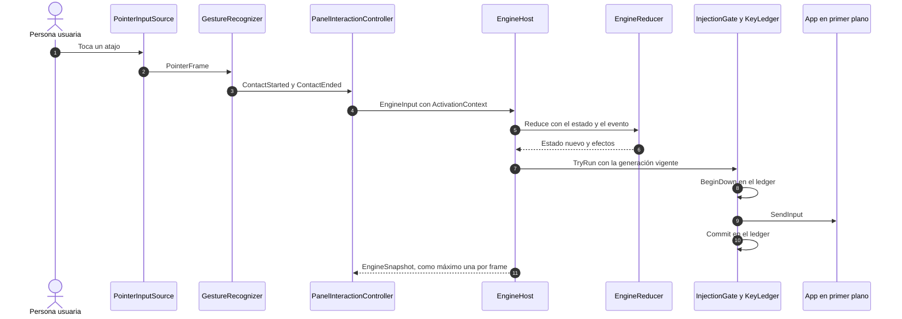
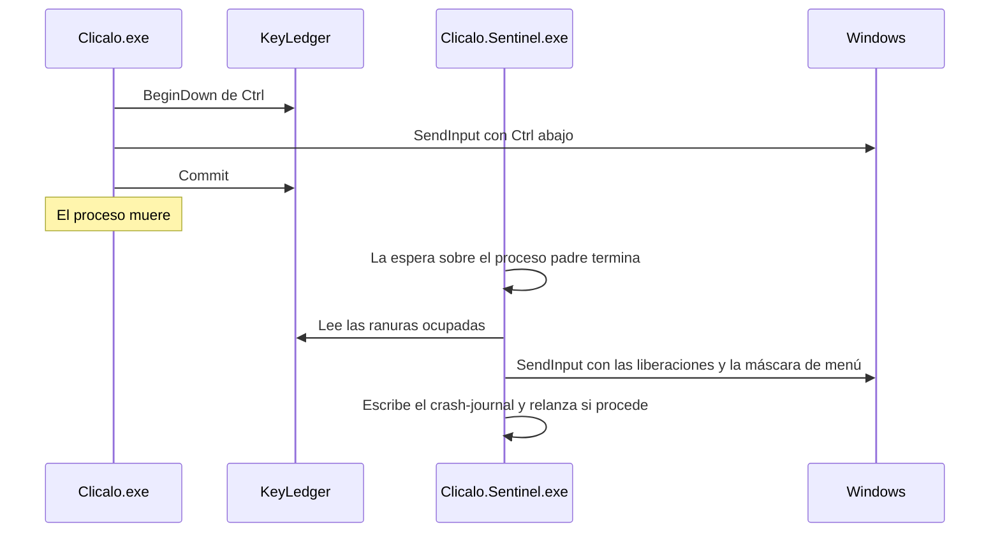

# Visión general de la arquitectura

Resumen de la arquitectura de Clícalo con la estructura de [arc42](https://arc42.org/) en versión ligera y
diagramas del [modelo C4](https://c4model.com/) en Mermaid. Es una puerta de entrada: el detalle y la
autoridad están en el [plano](blueprint.md) y en los [ADR](../adr/README.md). Si este documento discrepa
del plano, manda el plano.

Cada diagrama va seguido de una descripción textual equivalente, para quien lee con Narrador.

## 1. Introducción y objetivos

Clícalo es una aplicación de escritorio para Windows: un panel flotante, pensado primero para la
accesibilidad, que ejecuta atajos de teclado, macros, textos y acciones de mouse **solo con la pantalla
táctil o la voz**. Sucede a Macro Quick Access y se reconstruye desde cero.

### Objetivos de calidad

| Prioridad | Objetivo | Requisito | Cómo se mide |
|---|---|---|---|
| 1 | El panel nunca quita el foco a la app en primer plano | REG-01 | 20 toques seguidos escriben siempre en el Bloc de notas; `reg01.violations = 0` |
| 2 | Nunca queda una tecla pulsada | REG-03, SEG-007 | Invariantes INV-1 a INV-12 como propiedades; caos de Sentinel 50 de 50 |
| 3 | Todo se puede hacer sin teclado físico y todo se expone a UI Automation | REG-05, REG-06 | Recorridos solo con toque y con Acceso por voz; reglas UIA001–UIA010 |
| 4 | Nunca se pierden datos | REG-08 | `CrashingFileSystem` sin ningún documento perdido; importación 210 → 210 |
| 5 | Panel en menos de 1 s y toque → envío en menos de 50 ms | NFR-001 | Presupuestos de [§10.3 del plano](blueprint.md#103-presupuestos-de-rendimiento) en el equipo táctil |

### Partes interesadas

| Quién | Qué espera |
|---|---|
| Personas con movilidad reducida en las manos (lesión medular, ELA, artritis, temblor) | Hacer con un toque o con la voz lo que otros hacen con el teclado, sin que el panel estorbe |
| El mantenedor, que programa con pantalla táctil y voz | Un repositorio que se opera con órdenes dictables y que guía por sí mismo |
| Colaboradores, traductores y autores de plantillas | Contribuir sin tocar C# cuando se trata de datos, y con reglas que las máquinas hacen cumplir |
| Organizaciones de accesibilidad | Una herramienta libre (MIT), firmada y que no envía datos |

## 2. Restricciones

- Windows 10 22H2 o posterior y Windows 11; pantallas táctiles, varios monitores y escalas mixtas
  (NFR-011).
- C# 14 sobre .NET 10 LTS; WPF solo en la capa `Clicalo.UI.Wpf` ([ADR-0001](../adr/0001-framework-ui-wpf.md)).
- Las funcionalidades, los flujos, los textos y las medidas del paquete de diseño son vinculantes; su
  arquitectura y su tecnología no ([LEEME-VINCULANTE](../design/handoff/LEEME-VINCULANTE.md)).
- Sin telemetría: solo salen del equipo la comprobación de actualizaciones y, si el usuario la activa con
  su clave, la IA con 4 datos ([privacidad](../security/privacy.md)).
- Lo mantiene una persona: todo lo que cuesta operar se aplaza hasta que un requisito o una medida lo
  justifique.
- Licencia MIT con DCO ([ADR-0015](../adr/0015-licencia-mit-y-dco.md)).

## 3. Contexto y alcance (C4, nivel 1)

Descripción textual:

- La **persona usuaria** toca, dicta o invoca por UI Automation los botones de Clícalo.
- **Clícalo** inyecta teclas y acciones de mouse en la **app en primer plano** sin quitarle el foco.
- Con **Windows** se relaciona por UI Automation (Narrador, Acceso por voz, Reconocimiento de voz de
  Windows), TSF y el teclado táctil, los eventos del sistema, la bandeja, DPAPI y el Administrador de
  credenciales.
- Consulta **GitHub Releases** para actualizarse (un GET anónimo al arrancar y cada 24 h, desactivable).
- Solo si el usuario lo activa con su clave, envía 4 datos a un **proveedor de IA** para generar una
  plantilla.
- Importa una vez la configuración de **Macro Quick Access** (v1).
- El **mantenedor** publica versiones firmando el manifiesto con una llave de hardware fuera de GitHub.

## 4. Estrategia de solución

Las seis ideas del plano ([§1.1](blueprint.md#11-en-una-página)):

1. **No robar nunca el foco, en tres niveles:** por construcción (`NonActivatingWindow` y analizadores),
   por pruebas (ventana sonda que registra `WM_ACTIVATE`) y en producción (`ActivationGuard`). Los pocos
   flujos que necesitan el primer plano pasan por un único `ForegroundOrchestrator`
   ([ADR-0005](../adr/0005-superficies-no-activables-y-foreground-orchestrator.md)).
2. **Nunca queda una tecla pulsada:** motor puro con actor, *ledger* con escritura adelantada, valla de
   generación y guardián Sentinel ([ADR-0004](../adr/0004-motor-ledger-valla-y-sentinel.md)).
3. **Cuatro dueños de estado inmutables** y UI proyectada por funciones puras
   ([ADR-0003](../adr/0003-cuatro-duenos-de-estado.md)).
4. **Los datos son la fuente de verdad y lo generado no se edita:** textos, tokens de tema, catálogos,
   tiempos y medidas son datos versionados con esquema; los generadores de Roslyn convierten sus errores en
   errores de compilación.
5. **La calidad la imponen las máquinas:** analizadores `CLC*`, ArchUnitNET, reglas UIA propias,
   instantáneas, presupuestos de rendimiento, trazabilidad requisito → prueba y una cadena de suministro
   firmada. Una sola orden dictable, `cl`, reproduce en local lo que valida la CI.
6. **Operación a la medida de una persona y fronteras a la medida de un equipo**
   ([ADR-0002](../adr/0002-monolito-modular-hexagonal.md)).

## 5. Vista de bloques

### 5.1 Contenedores (C4, nivel 2)

Descripción textual:

| Contenedor | Tecnología | Vida | Responsabilidad | Presupuesto |
|---|---|---|---|---|
| `Clicalo.exe` | WPF sobre .NET 10, autocontenido, R2R | Toda la sesión | UI, motor, persistencia, actualizaciones e IA | 120 MB o menos de *working set* con 4 superficies; CPU media por debajo del 0,5 % en reposo |
| `Clicalo.Sentinel.exe` | .NET 10 Native AOT, sin WPF ni reflexión | Mientras viva el principal | Soltar lo que registra el *ledger*, relanzar el principal cuando procede y registrar el fallo | 5 MB o menos; 0 % de CPU (bloqueado en espera) |
| `Clicalo.Launcher.exe` | .NET 10 Native AOT (solo con el componente de sistema) | Segundos, al iniciar sesión o tras actualizar | Sincronizar y verificar la copia protegida y lanzarla elevada | 5 MB o menos; 300 ms o menos sin sincronización |
| `Update.exe` | Velopack | Puntual, siempre en integridad media | Aplicar un paquete ya verificado | — |

`Clicalo.exe` hereda a Sentinel solo tres *handles*: el proceso padre, el *ledger* en solo lectura y un
extremo de un pipe anónimo con latido cada segundo. El detalle está en
[§3.1 del plano](blueprint.md#31-vista-de-procesos).

### 5.2 Componentes por capa (C4, nivel 3)

Descripción textual, capa por capa (de fuera hacia dentro):

- **`Clicalo.App`:** raíz de composición con DI explícita (sin *Generic Host*), arranque, ciclo de vida y
  registro de los enrutadores.
- **`Clicalo.UI.Wpf`:** la única capa con WPF. `Windowing` (clase base no activable, `ActivationGuard`,
  colocación en píxeles físicos), `Pointer` (`PointerInputSource` sobre `WM_POINTER`), vistas, controles,
  *peers* de UIA y temas generados.
- **`Clicalo.Presentation`:** ViewModels sin tipos de WPF. Aplican el `PanelModel` proyectado y reenvían
  intenciones; ninguna regla de producto vive aquí.
- **`Clicalo.Application`:** casos de uso, puertos, los *stores* (`DocumentStore`, `SessionStore`,
  `InteractionStore`), `EngineHost`, `ForegroundOrchestrator`, proyecciones, avisos y localización.
- **`Clicalo.Domain`:** modelo, invariantes, comandos, `EngineReducer`, `ActivationPolicy`, `Touch`,
  `DimPolicy` y el resto de reglas puras. Solo BCL.
- **`Clicalo.Platform.Windows`:** adaptadores Win32 que implementan los puertos: hilo SysEvents, WinEvent,
  bandeja, primer plano, lanzamiento en el hilo Shell, sesión, portapapeles, secretos.
- **`Clicalo.Platform.Core`:** compatible con AOT y compartido con Sentinel y Launcher: `KeyLedger`,
  `InjectionGate`, inyección de bajo nivel, contratos IPC y verificación de confianza (`Trust`).
- **`Clicalo.Infrastructure`:** persistencia (DTO, migraciones, escritura atómica, uso), copias,
  catálogos, localización, IA, actualizaciones, registros y diagnóstico.

Relaciones principales: el puntero produce `PointerFrame` para el reconocedor de gestos; las vistas se
enlazan a los ViewModels; los ViewModels leen modelos proyectados desde los *stores* y envían peticiones
de activación a `EngineHost`; `EngineHost` reduce cada evento con `EngineReducer` y ejecuta sus efectos
bajo la valla de `Platform.Core`; `ForegroundOrchestrator` usa el puerto `IForegroundControl` de la
plataforma; `DocumentStore` persiste por `IDocumentRepository`.

### 5.3 Reglas de dependencia entre proyectos

Descripción textual: `Clicalo.App` depende de todo y nada depende de ella. UI.Wpf depende de
Presentation (y de los tipos de puerto de UI de Application y de Domain). Presentation, Platform.Windows e
Infrastructure dependen de Application, que depende de Domain. Platform.Windows usa Platform.Core entero;
Infrastructure y Launcher, solo su parte `Trust`; Sentinel, solo Platform.Core. Domain no depende de
ningún otro proyecto ni paquete. La tabla completa, con lo prohibido, está en
[§4.2 del plano](blueprint.md#42-proyectos-y-reglas-de-dependencia), y la hacen cumplir los seis
mecanismos de [§4.4](blueprint.md#44-cómo-se-hacen-cumplir-las-reglas).

## 6. Vista de ejecución

### 6.1 Del toque a la acción

Descripción textual: el toque llega como `WM_POINTER` a `PointerInputSource` (UI.Wpf), que produce
`PointerFrame`. `GestureRecognizer` (Domain, puro) emite el inicio y el fin del contacto.
`PanelInteractionController` (Presentation) añade el contexto de activación (origen, perfil, modo de
inyección, época de primer plano, última posición externa del puntero) y lo envía al buzón del motor.
`EngineHost` reduce el evento con `EngineReducer` y ejecuta cada efecto con `InjectionGate.TryRun`: anota la
pulsación en el *ledger*, llama a `SendInput` y confirma. Presupuestos: toque → `SendInput` y toque → frame
con p95 ≤ 50 ms ([§7.1 del plano](blueprint.md#71-del-toque-a-la-acción)).

### 6.2 Si el proceso principal muere

Descripción textual: toda pulsación se anota en el *ledger* antes de enviarse. Si `Clicalo.exe` muere,
Sentinel, que espera sobre el proceso padre, lee las ranuras ocupadas y envía las liberaciones en el modo
registrado, con la máscara de menú para Alt y Win. Después escribe el `crash-journal` y relanza la app,
salvo que el *ledger* tenga `CleanShutdown` o `NoRelaunch` o se haya superado el umbral de bucle de fallos
([ADR-0004](../adr/0004-motor-ledger-valla-y-sentinel.md)).

## 7. Vista de despliegue

| Ubicación | Contenido | Quién escribe |
|---|---|---|
| `%LocalAppData%\Clicalo.App\` | Instalación de Velopack (`packId Clicalo.App`) | Instancia de integridad media y `Update.exe` |
| `%AppData%\Clicalo\` | `clicalo.json`, `usage.json`, `.prev`, copias, cuarentena y `logs\clicalo.log` | `Clicalo.exe` (sobrevive a desinstalar) |
| `%LocalAppData%\Clicalo\` | Diagnóstico, volcados (solo si se activan), guardado de emergencia y `crash-journal.json` | `Clicalo.exe` y Sentinel |
| `%ProgramFiles%\Clicalo\` | Solo con el componente de sistema: `Clicalo.Launcher.exe`, `app\<versión>\` y `trust-state.json` | Solo administradores (el lanzador, elevado) |

- Instalación por usuario y sin UAC con `Setup.exe` de Velopack; autocontenida para `win-x64` y, en beta,
  `win-arm64` (propuesta P5).
- Una instancia por sesión de usuario, con mutex `Local\` y pipe restringido al usuario
  ([ADR-0010](../adr/0010-ipc-minima.md)).
- Integridad media por defecto; elevada solo si el usuario lo pide
  ([ADR-0009](../adr/0009-elevacion-y-componente-de-sistema.md)).

## 8. Conceptos transversales

- **Hilos** ([§3.2](blueprint.md#32-modelo-de-hilos)): UI (roles Surfaces y Workspace en un único
  dispatcher, salvo que S2 obligue a separarlos), Engine, SysEvents, Shell, Hook (bajo demanda) y
  Persistence. Entre hilos solo cruzan objetos inmutables y cada punto de mutación tiene un único escritor.
- **Tiempo:** todo lo que depende del tiempo usa `TimeProvider`; todo umbral vive en `timings.json` y se
  genera como constante (NFR-020).
- **Errores:** un único tipo `Error` con código estable, `MessageKey`, severidad, recuperación y forma de
  anuncio; `Result<T>` para errores esperados y excepciones solo para defectos. Toda frontera de error
  acaba en «Soltar todo» si el motor está implicado.
- **Datos como fuente de verdad:** textos (`data/i18n`), tokens de tema (`data/tokens`), catálogos y tiempos
  (`data/catalogs`), contenido (`data/content`) y esquemas (`data/schemas`). Los generadores convierten los
  errores de datos en errores de compilación, con la línea y la columna del JSON.
- **Localización:** JSON con marcadores con nombre y plurales CLDR, claves tipadas y cambio de idioma en
  caliente ([ADR-0011](../adr/0011-formato-i18n.md)).
- **Accesibilidad:** *peers* propios, `LiveSetting`, números de voz, un equivalente sin gesto para cada
  gesto y un botón «Dictar» junto a cada campo de texto libre
  ([§8.6](blueprint.md#86-accesibilidad-uia-y-números-de-voz)).
- **Seguridad y privacidad:** [modelo de amenazas](../security/threat-model.md) y
  [privacidad](../security/privacy.md).
- **Registros:** `ILogger` con `[LoggerMessage]`, redacción por tipos (`Sensitive<T>`, `SecretText`) y el
  analizador CLC0003 ([§9.4](blueprint.md#94-registros-y-diagnóstico)).

## 9. Decisiones de arquitectura

Las decisiones difíciles de revertir están en el [índice de ADR](../adr/README.md). La tabla completa de
decisiones clave (D1 a D24) está en [§1.2 del plano](blueprint.md#12-tabla-de-decisiones-clave), y las
desviaciones del plano en [deviations.md](deviations.md).

## 10. Requisitos de calidad

| Métrica | Presupuesto | Dónde es puerta |
|---|---|---|
| Primer frame en frío (arranque manual) | p50 700 ms, máximo 1000 ms | Equipo táctil |
| Primer frame al iniciar sesión | Máximo 1000 ms, sin excepción (NFR-001) | Equipo táctil |
| Toque → `SendInput` p95 y toque → frame p95 | 50 ms o menos cada uno | Equipo táctil |
| Cambio de perfil p95 | 300 ms o menos | Equipo táctil |
| *Working set* con 4 superficies · Sentinel · Launcher | 120 MB · 5 MB · 5 MB como máximo | Equipo táctil |
| CPU media en reposo durante 8 h | 0,5 % o menos | Equipo táctil, antes de cada estable |
| Proyección completa con 50 perfiles y 2000 atajos | 2 ms o menos | CI |

La tabla completa y cómo se mide están en [§10.3 del plano](blueprint.md#103-presupuestos-de-rendimiento);
la estrategia de pruebas, en [testing-strategy.md](testing-strategy.md).

## 11. Riesgos y deuda técnica

Los riesgos abiertos y su mitigación están en [§15.2 del plano](blueprint.md#152-riesgos-abiertos). Los
más relevantes hoy:

- **Spikes bloqueantes de M1** (S1, S3, S4 y S2): si S1, S3 o S4 fallan en WPF, se reabre
  [ADR-0001](../adr/0001-framework-ui-wpf.md) antes de escribir funcionalidad.
- **Arranque en frío de WPF frente a NFR-001 al iniciar sesión:** lo mide S5; solo si demuestra que no se
  puede cumplir se abre la propuesta P1 al usuario.
- **Escalera de primer plano por voz** y **UIA sobre ventanas no activables:** S3 y S4.
- ***Bus factor* de 1:** todo automatizado y documentado, `AGENTS.md` y un repositorio que guía por sí
  mismo.

## 12. Glosario

| Término | Significado |
|---|---|
| Panel | Ventana flotante de uso diario: formas Completa, Compacta, Pestaña, Burbuja u Oculto |
| Centro de control (CC) | Ventana grande de configuración, activable |
| Superficie | Cualquier ventana no activable del panel (panel, barra, asa, burbuja, laterales, menús, avisos) |
| Rol Surfaces / Workspace | Los dos roles lógicos del hilo de UI: superficies del panel, y Centro de control y bienvenida |
| Concesión | Permiso tipado y temporal del `ForegroundOrchestrator` para cambiar el primer plano |
| *Ledger* | Registro en memoria compartida de todo lo que Clícalo mantiene pulsado, escrito antes de pulsar |
| Valla de generación | Número de generación del motor que impide que un hilo viejo inyecte después de una emergencia |
| Sentinel | Proceso guardián Native AOT que suelta las teclas si muere el principal |
| Componente de sistema | Pieza opcional instalada con un UAC que permite iniciar elevado sin UAC |
| Proyección | Función pura que convierte el estado en el modelo que pinta la UI |
| Porción | Parte del documento que el deshacer restaura por separado |
| `InjectionMode` | Modo de inyección del perfil: `VirtualKey` (normal) o `ScanCode` (compatible) |
